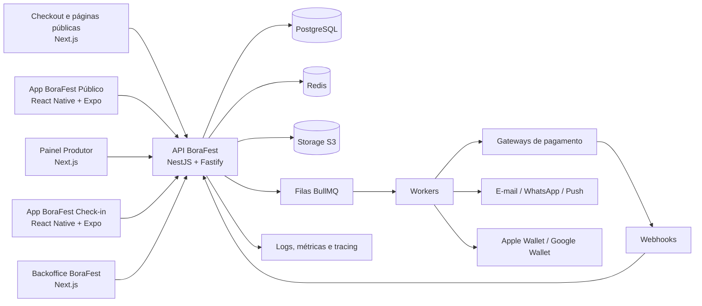
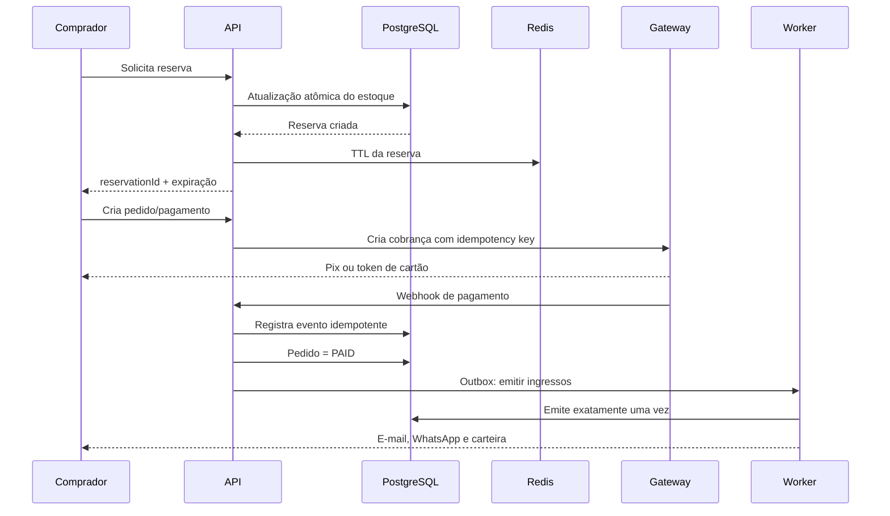

# BoraFest — Arquitetura Técnica da Plataforma de Ingressos

## 1. Leitura dos materiais enviados

Foram analisados:

- Protótipo da jornada do comprador, com 7 etapas: evento, seleção de ingressos, identificação, dados, pagamento, confirmação e carteira.
- Protótipo do painel do produtor, com onboarding, eventos, criação em etapas, dashboard, ingressos, vendas/PDV, participantes, check-in, divulgação e ajuda.
- Protótipo do app de validação, com PIN, seleção de evento e portão, scanner, resultados, busca manual, modo offline e resumo de portaria.
- Checklist com 160 funcionalidades: 62 do comprador, 74 do produtor e 24 da validação. A priorização contém 38 itens de MVP, 80 de V1 e 42 de V2.

### Diagnóstico

O protótipo já cobre a espinha dorsal visual do MVP e está bem organizado. Porém, é um protótipo navegável com dados e estados simulados. A parte mais difícil de uma ticketeria ainda precisa nascer na arquitetura:

- controle de estoque sem venda duplicada;
- reserva temporária de ingressos;
- pagamentos e webhooks idempotentes;
- emissão, cancelamento e transferência de ingressos;
- QR code assinado e não falsificável;
- check-in concorrente entre vários aparelhos;
- funcionamento offline com sincronização e auditoria;
- livro-caixa, taxas, repasses, estornos e chargebacks;
- backoffice administrativo da própria BoraFest.

## 2. Decisão arquitetural

### Recomendação: monólito modular, não microserviços no início

A primeira versão deve ser um monólito modular com API, workers, aplicações web e aplicativos móveis em React Native. Isso reduz complexidade operacional sem misturar as regras críticas do negócio.

A experiência será distribuída em cinco produtos:

1. checkout e páginas públicas na web, sem exigir instalação;
2. painel web do produtor;
3. aplicativo BoraFest para o público, em Android e iOS;
4. aplicativo BoraFest Check-in, em Android e iOS;
5. backoffice web da operação BoraFest.

- PostgreSQL será a fonte de verdade.
- Redis será usado para reservas temporárias, cache, rate limit e filas, mas nunca como única fonte de verdade.
- Processamentos assíncronos serão feitos por workers.
- Eventos internos serão persistidos usando Outbox Pattern.
- Os módulos terão fronteiras claras para poderem virar serviços separados no futuro, se o volume justificar.

## 3. Visão geral



### Princípio de produto

A compra não pode depender da instalação do aplicativo. O link público do evento abre um checkout web responsivo, permitindo que qualquer pessoa compre imediatamente. O aplicativo público adiciona descoberta, carteira, notificações e fidelização, mas não se torna uma barreira para a primeira compra.

## 4. Aplicações

### 4.1 `storefront-web` — página pública e checkout

Aplicação pública, rápida, indexável e otimizada para conversão.

Responsabilidades:

- página pública do evento;
- compartilhamento por link, redes sociais e QR Code;
- seleção de tipos, lotes, setores e quantidades;
- reserva de estoque com contador regressivo;
- checkout como convidado ou OTP;
- dados de participantes;
- Pix, cartão e carteiras aceitas pelo gateway;
- cupom;
- confirmação em tempo real;
- exibição imediata do ingresso no navegador;
- convite para instalar o app sem interromper a compra.

### 4.2 `customer-mobile` — aplicativo BoraFest

Aplicativo React Native publicado para Android e iOS.

Responsabilidades:

- descoberta e busca de eventos;
- favoritos e eventos próximos;
- compra pelo fluxo nativo ou redirecionamento autenticado ao checkout web;
- carteira de ingressos;
- QR Code do ingresso;
- transferência e reenvio;
- notificações de compra, alteração e proximidade do evento;
- histórico de pedidos;
- perfil, preferências e suporte;
- abertura de links de eventos por Universal Links e Android App Links.

O aplicativo público pode entrar depois do primeiro evento-piloto. Toda função essencial do comprador continuará disponível pela web.

### 4.3 `producer-web` — painel do produtor

Responsabilidades:

- onboarding PF/PJ;
- organização e membros;
- criação/publicação de eventos;
- lotes, setores, preços, taxas, cortesias e cupons;
- vendas, pedidos, PDV e reembolsos;
- participantes;
- financeiro e repasses;
- configuração de portões e validadores;
- relatórios;
- divulgação, pixels, UTMs e afiliados.

### 4.4 `validator-mobile` — BoraFest Check-in

Aplicativo React Native separado, publicado para Android e iOS e preparado para operação offline.

Responsabilidades:

- login por PIN ou credencial curta;
- registro e autorização do dispositivo;
- seleção de evento, sessão, portão e setor;
- leitura de QR pela câmera;
- retorno válido, inválido, cancelado ou já utilizado;
- busca manual por nome, CPF ou código;
- manifesto local de ingressos;
- fila local de check-ins;
- sincronização em lote;
- contador e ritmo de entrada;
- reversão com permissão e auditoria;
- bloqueio remoto de aparelho perdido ou não autorizado.

O validador fica separado do app público para reduzir permissões, superfície de ataque e risco operacional durante o evento.

### 4.5 `admin-web` — backoffice BoraFest

Este sistema não aparece nos protótipos, mas é obrigatório.

Responsabilidades:

- aprovação de KYC;
- gestão de organizadores, eventos e usuários;
- bloqueios e análise de risco;
- configuração de taxas e planos;
- controle de saldos, repasses e antecipações;
- estornos, chargebacks e disputas;
- suporte e auditoria;
- acompanhamento de webhooks e falhas;
- gestão de conteúdo e eventos denunciados;
- relatórios globais da plataforma.

## 5. Stack recomendada

### Web

- Next.js com TypeScript para checkout, painel do produtor e backoffice;
- React Server Components onde fizer sentido;
- Tailwind CSS e biblioteca interna de componentes web;
- TanStack Query para estados remotos;
- Zod para validação compartilhada de contratos;
- Server-Sent Events ou WebSocket para pagamento, vendas e check-in ao vivo.

### Mobile

- React Native com Expo e TypeScript;
- Expo Router para navegação e deep links;
- EAS Build e EAS Submit para builds e publicação;
- TanStack Query para dados remotos;
- Zustand ou estado local equivalente para fluxos temporários;
- Expo SecureStore para tokens e credenciais sensíveis;
- Expo SQLite para manifesto, ingressos autorizados e fila offline;
- câmera e leitura de QR por módulo compatível com Development Build;
- NetInfo para detectar conectividade;
- notificações push por APNs e FCM, abstraídas pelo backend;
- Sentry para falhas e telemetria de versão.

Usar Expo não impede código nativo. O projeto deve utilizar Development Builds desde cedo, evitando depender exclusivamente do Expo Go para câmera, segurança, notificações e bibliotecas nativas.

### Backend

- NestJS com adaptador Fastify;
- OpenAPI;
- Prisma ou Drizzle para acesso ao PostgreSQL;
- BullMQ para jobs;
- API compartilhada por web e mobile;
- autenticação por access token curto e refresh token rotativo nos apps.

### Dados e infraestrutura

- PostgreSQL gerenciado, com backup e recuperação ponto no tempo;
- Redis gerenciado;
- storage compatível com S3 para banners, documentos e exports;
- CDN para mídia e páginas públicas;
- containers Docker para API e workers;
- CI/CD com migrations controladas;
- ambiente separado para desenvolvimento, homologação e produção;
- canais mobile separados: development, preview/homologação e production.

Uma única VPS pode servir para um piloto pequeno, mas não deve ser a arquitetura de produção de um evento grande sem redundância, backup, monitoramento e plano de recuperação.

### Compartilhamento de código

Devem ser compartilhados entre web e mobile:

- contratos da API;
- schemas Zod;
- tipos de domínio;
- regras puras de negócio;
- tokens de design;
- cliente de autenticação e telemetria.

Os componentes visuais devem permanecer separados em `ui-web` e `ui-mobile`. Forçar o mesmo componente de interface em Next.js e React Native tende a aumentar a complexidade e limitar a experiência de cada plataforma.

## 6. Estrutura do monorepo

```text
borafest/
├── apps/
│   ├── storefront-web/      # evento público e checkout
│   ├── producer-web/        # painel do produtor
│   ├── admin-web/           # operação interna
│   ├── customer-mobile/     # app público Android e iOS
│   ├── validator-mobile/    # app de check-in Android e iOS
│   ├── api/                 # API modular
│   └── worker/              # filas e tarefas assíncronas
├── packages/
│   ├── ui-web/              # componentes web
│   ├── ui-mobile/           # componentes React Native
│   ├── design-tokens/       # cores, tipografia e espaçamentos
│   ├── contracts/           # DTOs, schemas Zod e tipos públicos
│   ├── database/            # schema e migrations
│   ├── auth/                # sessão, OTP e permissões
│   ├── observability/       # logs, métricas e tracing
│   ├── config/              # configuração tipada
│   └── testing/             # factories e utilitários
└── infra/
    ├── docker/
    ├── terraform/
    ├── eas/                 # perfis e credenciais de build mobile
    └── monitoring/
```

## 7. Módulos do backend

```text
Identity
Organizations
KYC
Events
Venues
Catalog
Inventory
Reservations
Checkout
Orders
Payments
Tickets
CheckIn
Coupons
Promoters
Notifications
Finance
Payouts
Refunds
Reports
Support
Audit
Admin
Integrations
```

### Regras de separação

- `Inventory` decide se existe disponibilidade.
- `Reservations` segura temporariamente unidades.
- `Orders` representa a intenção comercial.
- `Payments` conversa com gateways.
- `Tickets` somente emite após confirmação válida.
- `CheckIn` nunca altera pagamento ou estoque.
- `Finance` usa lançamentos imutáveis, não apenas um campo de saldo.

## 8. Modelo de dados principal

### Identidade e organizações

- `users`
- `user_identities`
- `otp_challenges`
- `organizations`
- `organization_members`
- `roles`
- `permissions`
- `organizer_verifications`
- `bank_accounts`

### Eventos e catálogo

- `events`
- `event_sessions`
- `venues`
- `event_media`
- `event_categories`
- `event_policies`
- `ticket_types`
- `ticket_lots`
- `sectors`
- `seats`
- `products`

### Venda

- `reservations`
- `reservation_items`
- `orders`
- `order_items`
- `order_participants`
- `payments`
- `payment_attempts`
- `payment_events`
- `refunds`
- `coupons`
- `coupon_redemptions`

### Ingressos e acesso

- `tickets`
- `ticket_transfers`
- `ticket_versions`
- `checkin_points`
- `validator_credentials`
- `validator_devices`
- `checkins`
- `checkin_sync_batches`
- `ticket_revocations`

### Financeiro e operação

- `ledger_accounts`
- `ledger_entries`
- `payouts`
- `payout_items`
- `platform_fees`
- `webhook_deliveries`
- `outbox_events`
- `notifications`
- `audit_logs`
- `idempotency_keys`

### Regras importantes do banco

- valores monetários em centavos inteiros;
- datas sempre com timezone;
- IDs UUIDv7 ou ULID, nunca IDs sequenciais expostos;
- `organization_id` nas entidades multi-tenant;
- constraints e índices para garantir integridade;
- lançamentos financeiros e auditoria devem ser append-only;
- CPF e documentos protegidos e acessíveis somente a funções autorizadas.

## 9. Máquinas de estado

### Evento

```text
DRAFT → PUBLISHED → SALES_PAUSED → SALES_CLOSED → COMPLETED
                   ↘ CANCELED
```

### Lote

```text
DRAFT → SCHEDULED → ACTIVE → SOLD_OUT
                         ↘ CLOSED
```

### Reserva

```text
ACTIVE → CONVERTED
   ├──→ EXPIRED
   └──→ CANCELED
```

### Pedido

```text
CREATED → PAYMENT_PENDING → PAID → FULFILLED
                    ├──→ EXPIRED
                    ├──→ CANCELED
PAID → REFUND_PENDING → PARTIALLY_REFUNDED / REFUNDED
PAID → CHARGEBACK
```

### Ingresso

```text
ISSUED → ACTIVE → CHECKED_IN
   ├──→ TRANSFERRED
   ├──→ CANCELED
   └──→ REFUNDED
```

## 10. Fluxo crítico de compra



### Como impedir overselling

A disponibilidade não deve ser calculada apenas no frontend ou no Redis. A operação precisa ser atômica no PostgreSQL, por exemplo atualizando o contador somente quando:

```text
vendidos + reservados + quantidade_solicitada <= capacidade
```

A expiração da reserva libera o estoque por worker. Redis acelera o timer, mas uma rotina de reconciliação no banco corrige qualquer falha de fila.

## 11. Pagamentos

Criar uma interface de gateway:

```ts
interface PaymentGateway {
  createPix(input): Promise<PixPayment>;
  createCardPayment(input): Promise<CardPayment>;
  refund(input): Promise<RefundResult>;
  getStatus(externalId): Promise<PaymentStatus>;
  verifyWebhook(headers, body): VerifiedWebhook;
}
```

Regras obrigatórias:

- idempotency key em criação, webhook, estorno e emissão;
- payload bruto do webhook armazenado;
- assinatura do webhook verificada;
- eventos fora de ordem tratados;
- reconciliação periódica com o gateway;
- cartão tokenizado pelo provedor para reduzir escopo PCI;
- um pagamento aprovado nunca pode emitir ingressos duas vezes.

## 12. QR code e validação offline

### Formato recomendado

O QR não deve carregar um ID simples. Ele deve conter um token compacto assinado com Ed25519 contendo:

```text
version
event_id
ticket_id
sector_id
nonce
issued_at
signature
```

O aplicativo React Native valida a assinatura localmente. Antes do evento, ele baixa um manifesto assinado contendo:

- chave pública do evento;
- ingressos válidos ou revogados permitidos para aquele portão;
- regras de reentrada;
- versão do manifesto;
- última sincronização;
- escopo do dispositivo e do operador.

### Armazenamento no aplicativo

- Expo SQLite armazena manifesto, índices de busca, check-ins e fila de sincronização;
- SecureStore guarda tokens, chaves do dispositivo e credenciais curtas;
- arquivos grandes de manifesto podem ser baixados de forma incremental e versionada;
- nenhuma chave privada de assinatura dos ingressos deve existir no aparelho.

### Operação offline

1. O aparelho valida a assinatura do QR localmente.
2. Consulta o estado local no SQLite.
3. Registra o check-in com horário, dispositivo, operador, portão e sequência local.
4. Marca o ingresso como utilizado naquele dispositivo.
5. Adiciona o evento à fila persistente de sincronização.
6. Ao recuperar a internet, envia um lote idempotente.
7. O servidor aceita o primeiro check-in e marca os demais como conflito.

A sincronização deve ocorrer também enquanto o aplicativo estiver aberto e conectado. Processamento em segundo plano é auxiliar e não pode ser a única estratégia, pois Android e iOS podem limitar sua execução.

### Limitação real

Dois aparelhos completamente offline não conseguem garantir entre si que o mesmo ingresso não foi apresentado nos dois. As mitigações são:

- dividir setores ou faixas de ingressos por portão;
- sincronização frequente quando houver rede;
- alertar quando o manifesto estiver antigo;
- manter trilha de conflito e auditoria;
- bloquear remotamente dispositivos comprometidos;
- em eventos de alto risco, exigir conectividade mínima ou rede local dedicada.

## 13. APIs principais

### Público e comprador

```text
GET    /v1/events/:slug
GET    /v1/events/:id/availability
POST   /v1/reservations
PATCH  /v1/reservations/:id
POST   /v1/orders
POST   /v1/orders/:id/payments/pix
POST   /v1/orders/:id/payments/card
GET    /v1/orders/:publicToken/status
GET    /v1/me/tickets
POST   /v1/tickets/:id/transfer
POST   /v1/orders/:id/refund-requests
```

### Produtor

```text
POST   /v1/organizations
POST   /v1/events
PATCH  /v1/events/:id
POST   /v1/events/:id/publish
POST   /v1/events/:id/ticket-types
POST   /v1/ticket-types/:id/lots
GET    /v1/events/:id/dashboard
GET    /v1/events/:id/orders
GET    /v1/events/:id/participants
POST   /v1/events/:id/coupons
POST   /v1/events/:id/complimentary-tickets
POST   /v1/orders/:id/refunds
GET    /v1/events/:id/financial-summary
```

### Validação

```text
POST   /v1/validator/sessions
POST   /v1/validator/devices/register
POST   /v1/validator/devices/:id/refresh
GET    /v1/validator/events
GET    /v1/validator/events/:id/manifest
GET    /v1/validator/events/:id/manifest/delta
POST   /v1/checkins
POST   /v1/checkins/sync
POST   /v1/checkins/:id/reverse
GET    /v1/events/:id/checkin-live
```

### Integrações

```text
POST   /v1/webhooks/payments/:provider
POST   /v1/webhooks/messages/:provider
GET    /v1/integrations/webhooks
POST   /v1/integrations/webhooks
```

## 14. Filas e workers

Filas sugeridas:

- `reservation-expiration`;
- `payment-reconciliation`;
- `ticket-issuance`;
- `ticket-delivery`;
- `wallet-pass-generation`;
- `refund-processing`;
- `payout-processing`;
- `checkin-reconciliation`;
- `report-generation`;
- `webhook-delivery`;
- `notification-delivery`;
- `media-processing`.

Todos os jobs precisam aceitar repetição sem produzir efeito duplicado.

## 15. Segurança e LGPD

- RBAC por organização e evento;
- MFA para administradores e ações financeiras;
- sessão de validador limitada a evento/portão;
- rate limit em OTP, login, checkout e scanner;
- proteção contra enumeração de pedido e ingresso;
- criptografia em trânsito e em repouso;
- documentos e CPF com acesso restrito;
- trilha de auditoria para publicação, preço, reembolso, saque e reversão;
- retenção e anonimização de dados;
- consentimento e política de privacidade versionados;
- backup, restauração testada e plano de desastre;
- WAF e proteção contra bots nas vendas concorridas.

## 16. Observabilidade

Métricas essenciais:

- taxa de conversão por etapa;
- reservas criadas, expiradas e convertidas;
- estoque disponível por lote;
- latência e erro do gateway;
- tempo entre webhook e emissão;
- ingressos emitidos em duplicidade: deve ser zero;
- scans por minuto e latência p95;
- conflitos de check-in offline;
- idade do manifesto dos validadores;
- valor vendido, taxa, saldo e repasse;
- falhas de fila e dead-letter queue.

Ferramentas sugeridas:

- OpenTelemetry;
- logs JSON estruturados;
- Sentry para frontend e backend;
- Prometheus/Grafana ou serviço equivalente;
- alertas por erro de pagamento, emissão, estoque e sincronização.

## 17. Escopo do MVP de evento-piloto

O checklist contém 38 itens classificados como MVP. Para o piloto, implementar:

### Comprador

- página do evento;
- tipos/lotes e quantidade;
- carrinho e reserva;
- convidado e OTP;
- Pix e cartão;
- taxa transparente;
- confirmação em tempo real;
- ingresso com QR;
- envio por e-mail e WhatsApp;
- checkout web responsivo;
- abertura e recuperação do ingresso sem aplicativo;
- consentimento LGPD.

### Produtor

- cadastro básico;
- lista, criação e edição de evento;
- publicar/despublicar;
- banner;
- tipos, preços, taxas, estoque e limite;
- dashboard de vendas;
- link público;
- configuração básica de portões e PIN;
- visão mínima de pedidos e participantes.

### Validação

- login por PIN;
- evento e portão;
- scanner;
- válido, inválido e já utilizado;
- busca manual;
- aplicativo React Native para Android e iOS;
- modo offline com SQLite;
- fila persistente de sincronização;
- autorização e bloqueio de dispositivo;
- resumo básico.

### Backoffice mínimo

- visualizar organizadores e eventos;
- configurar taxa;
- consultar pedidos e pagamentos;
- reenviar ingresso;
- executar estorno controlado;
- acompanhar webhooks e filas;
- bloquear evento, organização ou ingresso;
- visualizar auditoria.

## 18. Estratégia mobile e publicação

### Aplicativos publicados

Serão mantidos dois aplicativos independentes nas lojas:

1. **BoraFest**, voltado ao comprador;
2. **BoraFest Check-in**, voltado ao produtor e equipe de portaria.

Cada aplicativo terá identificadores, permissões, política de privacidade, ícones e ciclos de versão próprios.

### Perfis de build

```text
development  → uso interno com módulos nativos e depuração
preview      → homologação, QA e testes com produtores
production   → Google Play e Apple App Store
```

### Fluxo de entrega

```text
Pull request
  → testes e lint
  → build web e API
  → build mobile de preview
  → homologação
  → build de produção
  → envio para Play Console e App Store Connect
  → liberação gradual
```

### Requisitos que precisam entrar no planejamento

- contas de organização na Apple e no Google;
- dados legais, fiscais e bancários consistentes;
- política de privacidade e termos públicos;
- página de suporte e exclusão de conta;
- textos e capturas das lojas;
- permissão de câmera explicada de forma clara;
- revisão específica do fluxo de login, compra e exclusão;
- testes em aparelhos Android de baixo custo e diferentes versões de iPhone;
- estratégia de atualização obrigatória apenas quando houver incompatibilidade de segurança ou protocolo.

### Pagamento dentro do app

Ingressos representam acesso a eventos presenciais. A integração deve usar o gateway de pagamento da plataforma, mantendo uma camada abstrata para Pix, cartão e carteiras aceitas. No MVP, o caminho mais seguro para conversão e velocidade é reutilizar o checkout web autenticado; posteriormente, o app público pode receber uma experiência nativa de pagamento sem alterar os módulos de pedidos, reservas e pagamentos do backend.

### Atualizações do aplicativo

Atualizações de JavaScript e recursos compatíveis podem usar o mecanismo de atualização do Expo. Mudanças em módulos nativos, permissões ou SDKs exigem novo binário e nova submissão às lojas. Toda atualização deve respeitar a compatibilidade entre versão do app e versão da API.

## 19. Evolução após o piloto

### V1

- KYC completo;
- repasses e extrato;
- cupons;
- meia-entrada;
- PDV;
- reembolso self-service;
- participantes e exportações;
- múltiplos validadores e portões;
- analytics;
- pixels e UTM;
- papéis e permissões;
- notificações de alteração.

### V2

- assentos marcados;
- eventos recorrentes e multi-dia;
- produtos adicionais e combos;
- afiliados/promotores;
- split entre co-produtores;
- antecipação;
- carteiras digitais completas;
- transferência e revenda oficial;
- multilíngue;
- API pública e webhooks avançados.

## 20. Diferenciais de produto a preservar

O protótipo já indica bons diferenciais. Eles devem virar regras reais:

- começar a vender enquanto o KYC é analisado, mantendo o repasse bloqueado até a aprovação;
- checkout sem conta obrigatória e sem download;
- taxa exibida desde a seleção;
- Pix atualizado na tela em segundos;
- carteira e reenvio simples por WhatsApp;
- painel de vendas e check-in ao vivo;
- validação offline com fila, conflito e auditoria claros;
- criação de evento rápida, com lote e hotsite no mesmo fluxo;
- operação de portaria sem equipamento especial.

## 21. Ordem recomendada de construção

1. Monorepo, autenticação, organizações, RBAC, banco e observabilidade.
2. Eventos, tipos, lotes, estoque e publicação.
3. Checkout web, reserva e pedidos.
4. Gateway, webhooks, pagamentos e emissão de ingressos.
5. Carteira web, e-mail, WhatsApp e links profundos.
6. Aplicativo React Native de check-in online.
7. Manifesto, SQLite, assinatura local e sincronização offline.
8. Painel de vendas, pedidos, participantes e backoffice mínimo.
9. Ledger, taxas, estornos e repasses.
10. Publicação do BoraFest Check-in na Google Play e Apple App Store.
11. Evento-piloto, testes de carga e hardening.
12. Aplicativo público BoraFest com carteira, descoberta e notificações.

A publicação do app público não deve bloquear o primeiro evento. O validador mobile e o checkout web têm prioridade operacional maior no MVP.

## 22. Testes que bloqueiam o lançamento

- concorrência de centenas de compras no último ingresso;
- webhook duplicado e fora de ordem;
- pagamento aprovado depois da reserva expirar;
- timeout durante a emissão;
- reenvio sem criar novo ingresso;
- reembolso parcial e total;
- QR copiado e apresentado duas vezes;
- vários aparelhos validando ao mesmo tempo;
- aparelhos offline usando o mesmo ingresso;
- sincronização interrompida e retomada;
- cancelamento de ingresso já baixado offline;
- restauração do banco e retomada das filas;
- carga de scanner no pico de entrada;
- instalação limpa e atualização sobre versão anterior;
- expiração e renovação de sessão no mobile;
- perda de conectividade durante download do manifesto;
- aparelho com pouco armazenamento ou bateria;
- câmera negada, indisponível ou com baixa luminosidade;
- compatibilidade entre versões antigas do app e a API.

## 23. Resumo executivo

O BoraFest deve combinar web e mobile sem obrigar o comprador a instalar um aplicativo. A página pública e o checkout ficam em Next.js; o painel do produtor e o backoffice também permanecem na web. O aplicativo público e o aplicativo de check-in são construídos com React Native e Expo, publicados para Android e iOS e conectados à mesma API central.

A plataforma começa como monólito modular com cinco interfaces, uma API, workers, PostgreSQL, Redis e storage S3. O app de check-in é parte do MVP operacional; o app público pode entrar depois do piloto sem prejudicar vendas ou emissão de ingressos.

As cinco fundações que não podem ser improvisadas são:

1. inventário e reserva atômicos;
2. pagamentos e emissão idempotentes;
3. QR assinado e ciclo de vida do ingresso;
4. validação offline com SQLite, sincronização e auditoria;
5. versionamento seguro entre aplicativos móveis e API.

Com essa estrutura, o BoraFest pode ser publicado na Google Play e Apple App Store, continuar vendendo por link na web e crescer sem exigir uma reescrita completa quando o volume aumentar.
